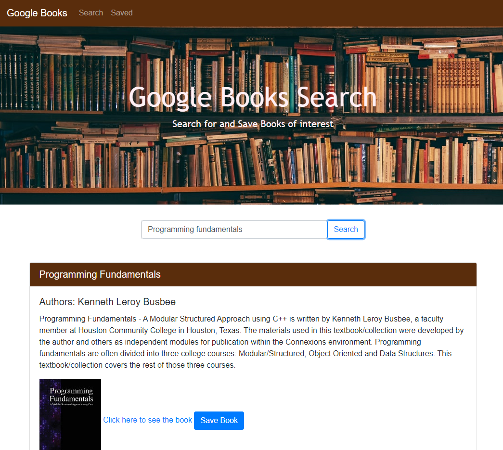

# Google Books MERN App

## Description
This [web application](https://serene-hollows-29640.herokuapp.com/) deployed on Heroku is a full-stack application built with the MERN stack (Mongo, Express, React, Node). A user visiting the page can use the central search field to query the Google Books API for the ten most relevant results. Each book's title, author(s), synopsis, cover image, and a link to its Google Books URL are displayed. The user can also click the "Save Book" button to add a book to the MongoDB database. Saved books will be visible on the "Saved" page, where the user has the option to click "DELETE" to remove individual books from the database. 


## Table of Contents
* [Technologies Used](#technologies-used)
* [How to Access](#how-to-access)
* [What I Did](#what-i-did)
* [Code Snippets](#code-snippets)
* [Screenshots](#screenshots)
* [Authors](#authors)

---

## Technologies Used
* [React](https://reactjs.org/) for building a dynamic, component-based UI for this webpage using JavaScript and JSX.
* [Node.js](https://nodejs.org/en/docs/) to run this Javascript program in the terminal/Git Bash console during development.
* [Express](https://www.npmjs.com/package/express) for the use of shorthand methods for developing server code with Javascript.
* [MongoDB](https://www.mongodb.com/what-is-mongodb) as a document database for storing and querying data in the app.
* [Mongoose](https://mongoosejs.com/) as an ORM to manipulate the MongoDB database.
* [Bootstrap](https://getbootstrap.com/) for its library of HTML element classes and corresponding CSS styles.
* [Git](https://git-scm.com/) for distributed version control, tracking changes over time and making them visible to collaborators.
* [Github](https://github.com/) for version control in the cloud, saving my changes and presenting them clearly to myself and others.

## How to Access
This webpage is accessible on most browsers and is hosted on Heroku. The site can be [accessed here](https://serene-hollows-29640.herokuapp.com/), and here: <https://serene-hollows-29640.herokuapp.com/>

---

## What I Did
All of the frontend elements on this page were built using React components, which were passed data from backend database and API queries. Visual stylings were applied using Bootstrap classes We used a backend Mongo database to handle CREATE, READ, and DELETE requests for saving books, viewing saved books, and deleting saved books from the database, which is hosted on AtlasDB. We utilized the Google Books API for the book search functionality and to provide each book's details.

## Code Snippets 
The code snippet below represents the contents of the Saved page functional component. I employed the useState hook for efficient manipulation of a stateful array, `saved`, that holds the book objects passed to the `Table` component to be rendered to the page in the JSX present in the return statement. The useEffect hook is configured to call the `loadBooks()` function only when the component first mounts, performing a query to the backend database for all saved book objects to insert them into the `saved` array. The function `deleteBook()` is also passed as a prop to each `Table` component to provide functionality for the DELETE button present there. This function removes that particular book from the database by targeting its ObjectId, and then calls loadBooks() once again to repopulate the page with the updated database values.

```javascript
const [saved, setSaved] = useState([]);

useEffect(() => {
    loadBooks();
}, []);

function loadBooks() {
    API.getBooks()
        .then((res) => setSaved(res.data))
        .catch((err) => console.log(err));
}

function deleteBook(book) {
    const bookId = book._id;
    API.deleteBook(bookId)
        .then(() => loadBooks())
        .catch((err) => console.log(err));
}

return (
    <div>
        <NavBar />
        <header className="text-center my-5">
            <h1>Saved Books</h1>
        </header>
        <div className="container">
            <h5 className="card-header trimcolor">Results</h5>
            {saved.map((book, index) => {
                return <Table
                    book={book}
                    onClick={deleteBook}
                    key={index}
                    id={book._id}
                    status="saved"
                />
            })}
        </div>
    </div>
)
```

## Screenshots
Example of the Search page:



Example of the Saved page:


---

## Authors
My name is Rand Hale, and I am an aspiring programmer/web developer based in California.

* [LinkedIn](https://www.linkedin.com/in/rand-hale-83ba389b/)
* [GitHub](https://github.com/prophetrand)
* [Porfolio](https://prophetrand.github.io/portefeuille-reactif/)

I built this web app from start to finish in full collaboration with my two classmates:

**Sammy Kroner**: <https://github.com/sammyk118>

**Ron-Arjay Caluag**: <https://github.com/ArjayCaluag>